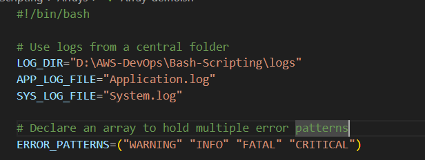

What is an Array?

An array in Bash is a variable that can store multiple values (called elements) under one name. Each element is accessed using an index number starting at 0.

Key Concepts:

Indexed arrays: Default Bash arrays, accessed by numeric indices (0,1,2,...)

Elements: The individual values inside an array

Index: Position of an element in the array (starts at 0)

Access: Use ${array[index]} to access elements, ${array[@]} to access all

Modification: You can add, remove, or update elements dynamically

LOG_DIR, APP_LOG_FILE, and SYS_LOG_FILE are normal variables holding strings.

ERROR_PATTERNS is an array variable holding multiple strings related to error levels.